---
## Front matter
title: "Отчёт по лабораторной работе №1"
author: "Алина Сергеевна Доберштейн"

## Generic otions
lang: ru-RU
toc-title: "Содержание"

## Bibliography
bibliography: bib/cite.bib
csl: pandoc/csl/gost-r-7-0-5-2008-numeric.csl

## Pdf output format
toc: true # Table of contents
toc-depth: 2
lof: true # List of figures
lot: true # List of tables
fontsize: 12pt
linestretch: 1.5
papersize: a4
documentclass: scrreprt
## I18n polyglossia
polyglossia-lang:
  name: russian
  options:
	- spelling=modern
	- babelshorthands=true
polyglossia-otherlangs:
  name: english
## I18n babel
babel-lang: russian
babel-otherlangs: english
## Fonts
mainfont: PT Serif
romanfont: PT Serif
sansfont: PT Sans
monofont: PT Mono
mainfontoptions: Ligatures=TeX
romanfontoptions: Ligatures=TeX
sansfontoptions: Ligatures=TeX,Scale=MatchLowercase
monofontoptions: Scale=MatchLowercase,Scale=0.9
## Biblatex
biblatex: true
biblio-style: "gost-numeric"
biblatexoptions:
  - parentracker=true
  - backend=biber
  - hyperref=auto
  - language=auto
  - autolang=other*
  - citestyle=gost-numeric
## Pandoc-crossref LaTeX customization
figureTitle: "Рис."
tableTitle: "Таблица"
listingTitle: "Листинг"
lofTitle: "Список иллюстраций"
lotTitle: "Список таблиц"
lolTitle: "Листинги"
## Misc options
indent: true
header-includes:
  - \usepackage{indentfirst}
  - \usepackage{float} # keep figures where there are in the text
  - \floatplacement{figure}{H} # keep figures where there are in the text
---

# Цель работы

Целью данной работы является приобретение практических навыков установки операционной системы на виртуальную машину, настройки минимально необходимых для дальнейшей работы сервисов.

# Задание

1)Запуск VirtualBox и создание новой виртуальной машины (операционная система Linux, Fedora).
2)Настройка установки ОС.
3)Перезапуск виртуальной машины и установка драйверов для VirtualBox.
4)Подключение образа диска дополнений гостевой ОС.
5)Установка необходимого ПО для создания документации.
6)Выполнение домашнего задания.

# Теоретическое введение

Операционная система - это комплекс взаимосвязанных программ, который действует как интерфейс между приложениями и пользователями с одной стороны и аппаратурой компьютера с другой стороны.

VirtualBox - это специальное средство для виртуализации, позволяющее запускать операционную систему внтури другой. С помощью VirtualBox мы можем не только запускать ОС, но и настраивать сеть, обмениваться файлами и делать многое другое.

# Выполнение лабораторной работы

## Создание виртуальной машины

Создала новую виртуальную машину, указала имя (рис. @fig:001).

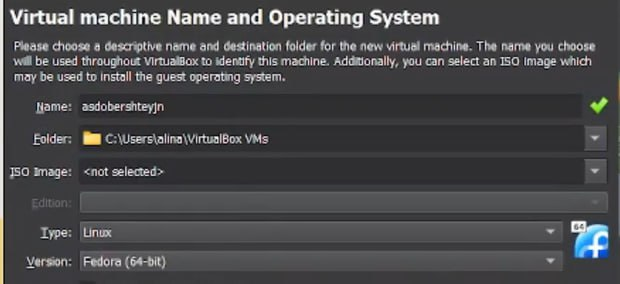{#fig:001 width=70%}

Указала размер основной памяти виртуальной машины - от 20448 МБ.(рис. @fig:002).

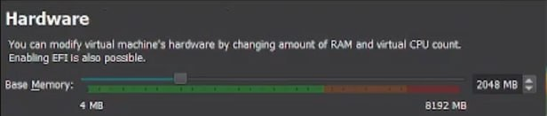{#fig:002 width=70%}

Задала размер диска - 80 ГБ. (рис. @fig:003).

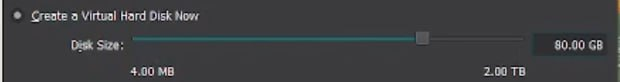{#fig:003 width=70%}

Добавила новый привод оптических дисков и выбрала нужный образ операционной системы Fedora. (рис. @fig:004).

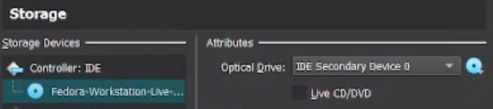{#fig:004 width=70%}

## После установки

Вошла в ОС под заданной при установке учетной записью.
Открыла терминал.
Переключилась на роль суперпользователя (команда sudo -i) (рис. @fig:005).

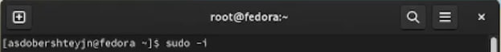{#fig:005 width=70%}

### Обновления

Обновила все пакеты (команда dnf -y update) (рис. @fig:006).

{#fig:006 width=70%}

### Повышение комфорта работы

Установила программу для удобства работы в консоли: (рис. @fig:007).

{#fig:007 width=70%}

### Автоматическое обновление

Установила ПО для автоматического обновления (рис. @fig:008).

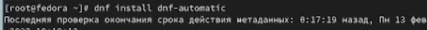{#fig:008 width=70%}

Запустила таймер (рис. @fig:009).

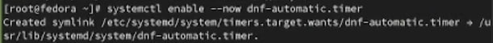{#fig:009 width=70%}

## Отключение SELinux

Запустила tmux, открыла midnight commander, в файле /etc/selinux/config заменила значение SELINUX=enforcing на SELINUX=permissive (рис. @fig:010).

{#fig:010 width=70%}

Перегрузила виртуальную машину с помощью команды reboot.

## Установка драйверов для VirtualBox

Зашла в ОС под своей учетной записью.
Открыла терминал.
Запустила терминальный мультиплексор tmux.
Переключилась на роль супер-пользователя (рис. @fig:011).

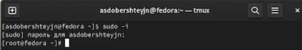{#fig:011 width=70%}

Установила пакет DKMS (рис. @fig:012).

{#fig:012 width=70%}

В меню виртуальной машины подключила образ диска дополненний гостевой ОС. (рис. @fig:013).

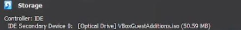{#fig:013 width=70%}

Подмонтировала диск (рис. @fig:014).

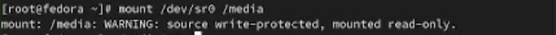{#fig:014 width=70%}

Установила драйвер (рис. @fig:015).

{#fig:015 width=70%}

Перегрузила виртуальную машину с помощью команды reboot.

## Установка программного обеспечения для создания документации

Открыла терминал, запустила терминальный мультиплексор tmux.
Переключилась на роль супер-пользователя (рис. @fig:016).

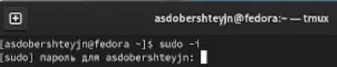{#fig:016 width=70%}

Установила pandoc (рис. @fig:017).

{#fig:017 width=70%}

Установила необходимые расширения (рис. @fig:018).

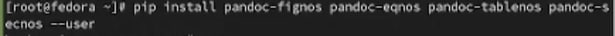{#fig:018 width=70%}

Установила дистрибутив TexLive (рис. @fig:019).

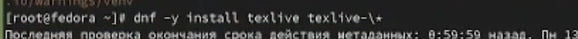{#fig:019 width=70%}

# Выводы

В результате выполнения лабораторной работы были приобретены навыки установки операционной системы на виртуальную машину, а также настройки минимально необходимых для дальнейшей работы сервисов.

# Контрольные вопросы

1) Какую информацию содержит учетная запись пользователя?

Имя пользователя, зашифрованный пароль пользователя, индентификационный номер пользователя, индентификационный номер группы пользователя, домашний каталог пользователя, командный интерпретатор пользователя.

2) Укажите команды терминала и приведите примеры: 
-для получения справки по команде: man <назввание команды>
-ддя перемещения по файловой системе: cd
-для просмотра содержимого каталога: ls
-для определения объема каталога: du <имя каталога>
-для создания каталогов: mkdir <имя каталога>
-для создания файлов: touch <имя файла>
-для удаления каталогов: rm <имя каталога>
-для удаления файлов: rm -r <имя файла>
-для задания определенных прав на файл или каталог: chmod + x <имя каталога или файла>
-для просмотра истории команд: history

3) Что такое файловая система? Приведите примеры с краткой характеристикой.

Файловая система - это часть операционной системы, назначение которой состоит в том, чтобы обеспечить пользователю удобный интерфейс при работе с данными, хранящимися на диске, и обеспечить совместное использование файлов несколькими пользователями и процессорами.
Примеры файловых систем: 
Ext2, Ext3, Ext4 или Extended Felisystem - стандартная файловая система для Linux.
ReiserFS - разработана немного позже в качестве альтернативы Ext3 с улучшенной производительностью и расширенными возможностями.

4) Как посмотреть, какие файловые системы подмонтированы в ОС?

С помощью команды mount

5) Как удалить зависший процесс?

С помощью команды kill.

# Домашнее задание

Получила информацию о версии ядра Linux (рис. @fig:020).

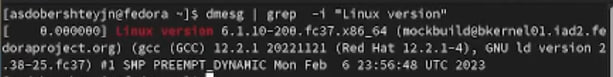{#fig:020 width=70%}

Получила информацию о частоте процессора (рис. @fig:021).

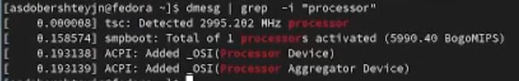{#fig:021 width=70%}

Получила информацию о модели процессора (рис. @fig:022).

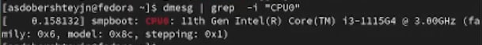{#fig:022 width=70%}

Получила информацию об объеме доступной оперативной памяти (рис. @fig:023), (рис. @fig:024)

{#fig:023 width=70%}

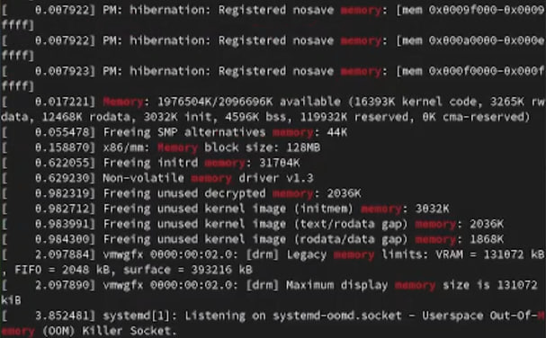{#fig:024 width=70%}

Получила информацию о типе обнаруженного гипервизора (рис. @fig:025).

{#fig:025 width=70%}

Получила информацию о последовательности монтирования файловых систем  (рис. @fig:026), (рис. @fig:027)

{#fig:026 width=70%}

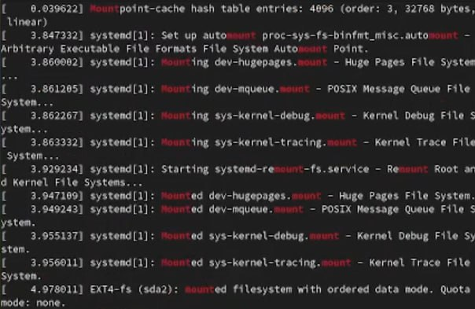{#fig:027 width=70%}

Получила информацию о типе файловой системы корневого раздела:
Зашла в приложение "Диски", увидела, что на корневой том смонтирован тип файловой системы Btrfs (рис. @fig:028).

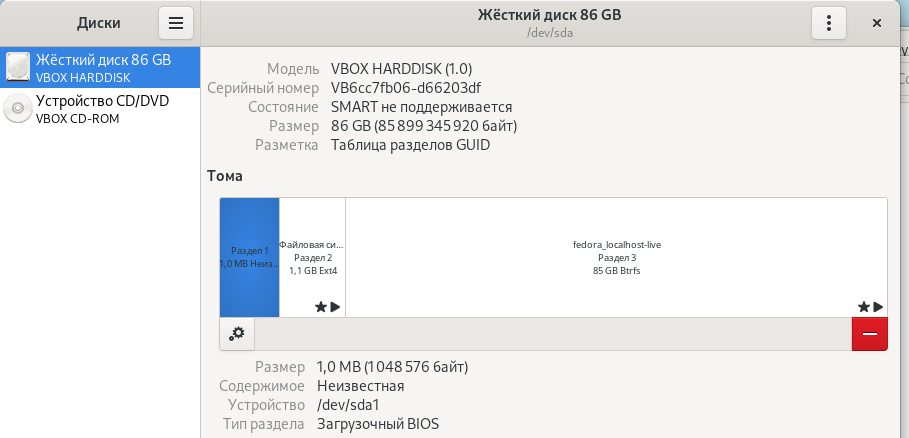{#fig:028 width=70%}

# Список литературы{.unnumbered}

1) Кулябов Д. С. Введерние в операционную систему UNIX - Лекция.
2) Таненбаум Э., Бос Х. Современные операционные системы. - 4-е изд. -СПб. : Питер, 2015. - 1120 с.

::: {#refs}
:::
