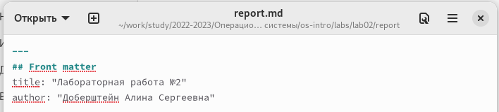
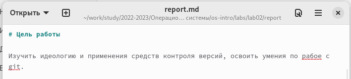
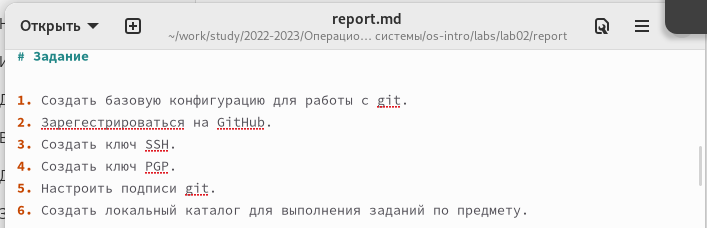
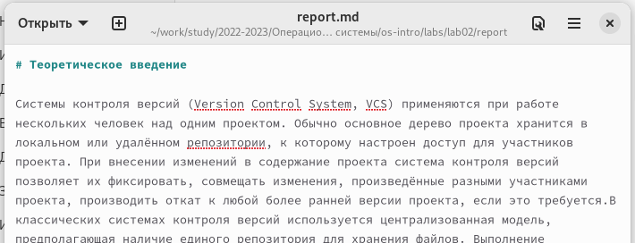
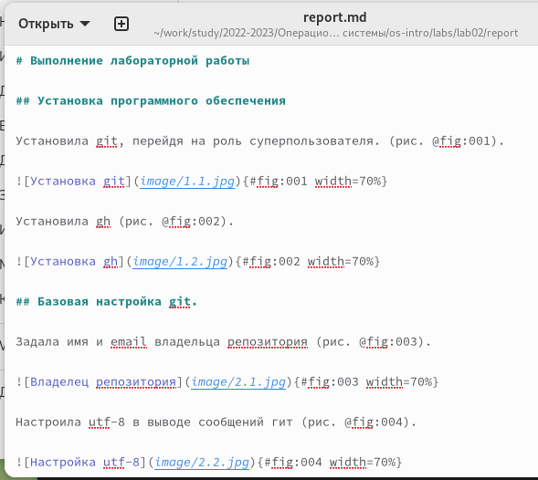
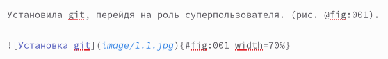
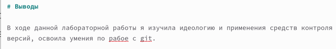
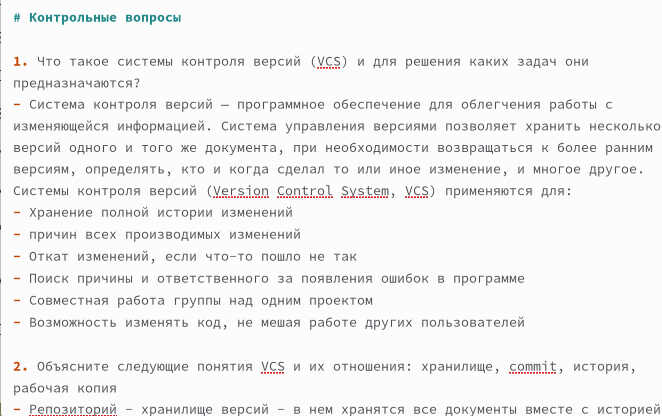
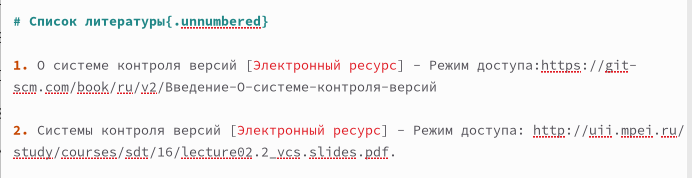

---
## Front matter
title: "Отчёт по лабораторной работе №3"
subtitle: "Операционные системы"
author: "Алина Сергеевна Доберштейн"

## Generic otions
lang: ru-RU
toc-title: "Содержание"

## Bibliography
bibliography: bib/cite.bib
csl: pandoc/csl/gost-r-7-0-5-2008-numeric.csl

## Pdf output format
toc: true # Table of contents
toc-depth: 2
lof: true # List of figures
lot: true # List of tables
fontsize: 12pt
linestretch: 1.5
papersize: a4
documentclass: scrreprt
## I18n polyglossia
polyglossia-lang:
  name: russian
  options:
	- spelling=modern
	- babelshorthands=true
polyglossia-otherlangs:
  name: english
## I18n babel
babel-lang: russian
babel-otherlangs: english
## Fonts
mainfont: PT Serif
romanfont: PT Serif
sansfont: PT Sans
monofont: PT Mono
mainfontoptions: Ligatures=TeX
romanfontoptions: Ligatures=TeX
sansfontoptions: Ligatures=TeX,Scale=MatchLowercase
monofontoptions: Scale=MatchLowercase,Scale=0.9
## Biblatex
biblatex: true
biblio-style: "gost-numeric"
biblatexoptions:
  - parentracker=true
  - backend=biber
  - hyperref=auto
  - language=auto
  - autolang=other*
  - citestyle=gost-numeric
## Pandoc-crossref LaTeX customization
figureTitle: "Рис."
tableTitle: "Таблица"
listingTitle: "Листинг"
lofTitle: "Список иллюстраций"
lotTitle: "Список таблиц"
lolTitle: "Листинги"
## Misc options
indent: true
header-includes:
  - \usepackage{indentfirst}
  - \usepackage{float} # keep figures where there are in the text
  - \floatplacement{figure}{H} # keep figures where there are in the text
---

# Цель работы

Научиться оформлять отчеты с помощью легковесного языка разметки Markdown.

# Задание

-Сделать отчет по предыдцщей лабораторной работе в формате Markdown.

# Теоретическое введение

Чтобы создать заголовок, используйте знак ( # ), например:
1 # This is heading 1
2 ## This is heading 2
3 ### This is heading 3
4 #### This is heading 4

Чтобы задать для текста полужирное начертание, заключите его в двойные звездочки:
1 This text is **bold**.

Чтобы задать для текста курсивное начертание, заключите его в одинарные звездочки:
1 This text is *italic*.

Чтобы задать для текста полужирное и курсивное начертание, заключите его в тройные
звездочки:
1 This is text is both ***bold and italic***.

Блоки цитирования создаются с помощью символа >:
1 > The drought had lasted now for ten million years, and the reign of
the terrible lizards had long since ended. Here on the Equator, in
the continent which would one day be known as Africa, the battle
for existence had reached a new climax of ferocity, and the victor
was not yet in sight. In this barren and desiccated land, only the
small or the swift or the fierce could flourish, or even hope to
survive.

Неупорядоченный (маркированный) список можно отформатировать с помощью звез-
дочек или тире:
1 - List item 1
2 - List item 2
3 - List item 3

Для обработки файлов в формате Markdown будем использовать Pandoc
https://pandoc.org/. Конкретно, нам понадобится программа pandoc ,
pandoc-citeproc https://github.com/jgm/pandoc/releases, pandoc-crossref
https://github.com/lierdakil/pandoc-crossref/releases.

Преобразовать файл README.md можно следующим образом:
1 pandoc README.md -o README.pdf
или так
1 pandoc README.md -o README.docx

Лабораторная работа является небольшой научно-исследовательской работой, которую
и оформлять следует по всем утверждённым требованиям. При подготовке отчета по ла-
бораторной работе вы освоите ряд важных элементов, которые в дальнейшем пригодятся
вам при написании курсовой и дипломной работы.

Согласно ГОСТ 7.32-2001, любая научно-исследовательская работа должна обязательно
содержать следующие элементы:
– титульный лист;
– реферат;
– введение;
– основную часть;
– заключение.
Также ГОСТ рекомендует включить в работу и такие элементы:
– список исполнителей;
– содержание;
– нормативные ссылки;
– определения;
– обозначения и сокращения;
– список использованных источников;
– приложения.
Если вы проводите сложную работу, выполняемую в несколько этапов, то вам может
понадобиться включить в работу часть или все элементы второго списка.

Отчёт должен включать:
1. Титульный лист с указанием номера лабораторной работы и ФИО студента.
2. Формулировка задания работы.
3. Описание результатов выполнения задания:
– скриншоты (снимки экрана), фиксирующие выполнение лабораторной работы;
– ответы на вопросы;
4. Выводы, согласованные с заданием работы.

# Выполнение лабораторной работы

Открыла файл report.md с помощью текстового редактора.
Изменила титульный лист, исправив title и информацию об авторе.(рис. @fig:001).

{#fig:001 width=70%}

Написала цель работы, согласно инструкции к выполнению лабораторной работы. (рис. @fig:002).

{#fig:002 width=70%}

Описала задание (рис. @fig:003).

{#fig:003 width=70%}

Написала теоретическое введение к лабораторной работе №2 (рис. @fig:004).

{#fig:004 width=70%}

Описала выполнение лабораторной работы по пунктам.
Для выделения заголовков использовала символы '#'. (рис. @fig:005).

{#fig:005 width=70%}

Предварительно перенесла нужные скриншоты в папку image, находящуюся в папке report папки lab02.
Прикрепила путь к скриншоту и подписала его, как показано в инструкции к лвбораторной работе. Задала масштаб и номер скриншота. (рис. @fig:006).

{#fig:006 width=70%}

Оформила вывод по лабораторной работе. (рис. @fig:007).

{#fig:007 width=70%}

Ответила на контрольные вопросы к лабораторной работе (рис. @fig:008).

{#fig:008 width=70%}

Оставила список используемой литературы (рис. @fig:009).

{#fig:009 width=70%}

С помощью команды make скопмилировала отчет в форматах pdf и docx.

# Выводы

В ходе выполнения этой лабораторной работы я научилась делать отчеты по лабораторным работам в формате Markdown.

# Список литературы{.unnumbered}

Справочник по Docs Markdown [Электронный ресурс]. Free Software Foundation. URL: https://docs.microsoft.com/ru-ru/contribute/markdown-reference.

::: {#refs}
:::
