---
## Front matter
title: "Лабораторная работа №8"
author: "Доберштейн Алина Сергеевна; НКАбд-01-22"

## Generic otions
lang: ru-RU
toc-title: "Содержание"

## Bibliography
bibliography: bib/cite.bib
csl: pandoc/csl/gost-r-7-0-5-2008-numeric.csl

## Pdf output format
toc: true # Table of contents
toc-depth: 2
lof: true # List of figures
lot: true # List of tables
fontsize: 12pt
linestretch: 1.5
papersize: a4
documentclass: scrreprt
## I18n polyglossia
polyglossia-lang:
  name: russian
  options:
	- spelling=modern
	- babelshorthands=true
polyglossia-otherlangs:
  name: english
## I18n babel
babel-lang: russian
babel-otherlangs: english
## Fonts
mainfont: PT Serif
romanfont: PT Serif
sansfont: PT Sans
monofont: PT Mono
mainfontoptions: Ligatures=TeX
romanfontoptions: Ligatures=TeX
sansfontoptions: Ligatures=TeX,Scale=MatchLowercase
monofontoptions: Scale=MatchLowercase,Scale=0.9
## Biblatex
biblatex: true
biblio-style: "gost-numeric"
biblatexoptions:
  - parentracker=true
  - backend=biber
  - hyperref=auto
  - language=auto
  - autolang=other*
  - citestyle=gost-numeric
## Pandoc-crossref LaTeX customization
figureTitle: "Рис."
tableTitle: "Таблица"
listingTitle: "Листинг"
lofTitle: "Список иллюстраций"
lotTitle: "Список таблиц"
lolTitle: "Листинги"
## Misc options
indent: true
header-includes:
  - \usepackage{indentfirst}
  - \usepackage{float} # keep figures where there are in the text
  - \floatplacement{figure}{H} # keep figures where there are in the text
---

# Цель работы

Познакомиться с операционной системой Linux. Получить практические навыки работы с редактором vi, установленным по умолчанию практически во всех дистрибутивах.

# Задание

1. Ознакомиться с теоретическим материалом.
2. Ознакомиться с редактором vi.
3. Выполнить упражнения, используя команды vi.
4. Создайте каталог с именем ~/work/os/lab06.
5. Перейдите во вновь созданный каталог.
6. Вызовите vi и создайте файл hello.sh
7. Нажмите клавишу i и вводите следующий текст
8. Нажмите клавишу Esc для перехода в командный режим после завершения ввода
текста.
9. Нажмите : для перехода в режим последней строки и внизу вашего экрана появится
приглашение в виде двоеточия.
10. Нажмите w (записать) и q (выйти), а затем нажмите клавишу Enter для сохранения
вашего текста и завершения работы.
11. Сделайте файл исполняемым
12. Вызовите vi на редактирование файла
13. Установите курсор в конец слова HELL второй строки.
14. Перейдите в режим вставки и замените на HELLO. Нажмите Esc для возврата в команд-
ный режим.
15. Установите курсор на четвертую строку и сотрите слово LOCAL.
16. Перейдите в режим вставки и наберите следующий текст: local, нажмите Esc для
возврата в командный режим.
17. Установите курсор на последней строке файла. Вставьте после неё строку, содержащую
следующий текст: echo $HELLO.
18. Нажмите Esc для перехода в командный режим.
19. Удалите последнюю строку.
20. Введите команду отмены изменений u для отмены последней команды.
21. Введите символ : для перехода в режим последней строки. Запишите произведённые
изменения и выйдите из vi.

# Теоретическое введение

В большинстве дистрибутивов Linux в качестве текстового редактора по умолчанию
устанавливается интерактивный экранный редактор vi (Visual display editor).
Редактор vi имеет три режима работы:
– командный режим — предназначен для ввода команд редактирования и навигации по
редактируемому файлу;
– режим вставки — предназначен для ввода содержания редактируемого файла;
– режим последней (или командной) строки — используется для записи изменений в файл
и выхода из редактора.
Для вызова редактора vi необходимо указать команду vi и имя редактируемого файла:
vi <имя_файла>
При этом в случае отсутствия файла с указанным именем будет создан такой файл.
Переход в командный режим осуществляется нажатием клавиши Esc . Для выхода из
редактора vi необходимо перейти в режим последней строки: находясь в командном
режиме, нажать Shift-; (по сути символ : — двоеточие), затем:
– набрать символы wq, если перед выходом из редактора требуется записать изменения
в файл;
– набрать символ q (или q!), если требуется выйти из редактора без сохранения.
8.2.1.2. Команды позиционирования
– 0 (ноль) — переход в начало строки;
– $ — переход в конец строки;
– G — переход в конец файла;
– 𝑛 G — переход на строку с номером 𝑛.
8.2.1.3. Команды перемещения по файлу
– Ctrl-d — перейти на пол-экрана вперёд;
– Ctrl-u — перейти на пол-экрана назад;
– Ctrl-f — перейти на страницу вперёд;
– Ctrl-b — перейти на страницу назад.
8.2.1.4. Команды перемещения по словам1
– W или w — перейти на слово вперёд;
– 𝑛 W или 𝑛 w — перейти на 𝑛 слов вперёд;
– b или B — перейти на слово назад;
– 𝑛 b или 𝑛 B — перейти на 𝑛 слов назад
8.2.2. Команды редактирования
8.2.2.1. Вставка текста
– а — вставить текст после курсора;
– А — вставить текст в конец строки;
– i — вставить текст перед курсором;
– 𝑛 i — вставить текст 𝑛 раз;
– I — вставить текст в начало строки.
8.2.2.2. Вставка строки
– о — вставить строку под курсором;
– О — вставить строку над курсором.
8.2.2.3. Удаление текста
– x — удалить один символ в буфер;
– d w — удалить одно слово в буфер;
– d $ — удалить в буфер текст от курсора до конца строки;
– d 0 — удалить в буфер текст от начала строки до позиции курсора;
– d d — удалить в буфер одну строку;
– 𝑛 d d — удалить в буфер 𝑛 строк.
8.2.2.4. Отмена и повтор произведённых изменений
– u — отменить последнее изменение;
– . — повторить последнее изменение.
8.2.2.5. Копирование текста в буфер
– Y — скопировать строку в буфер;
– 𝑛 Y — скопировать 𝑛 строк в буфер;
– y w — скопировать слово в буфер.
8.2.2.6. Вставка текста из буфера
– p — вставить текст из буфера после курсора;
– P — вставить текст из буфера перед курсором.
8.2.2.7. Замена текста
– c w — заменить слово;
– 𝑛 c w — заменить 𝑛 слов;
– c $ — заменить текст от курсора до конца строки;
– r — заменить слово;
– R — заменить текст.
8.2.2.8. Поиск текста
– / текст — произвести поиск вперёд по тексту указанной строки символов текст;
– ? текст — произвести поиск назад по тексту указанной строки символов текст.
8.2.4. Опции
Опции редактора vi позволяют настроить рабочую среду. Для задания опций использу-
ется команда set (в режиме последней строки):
– : set all — вывести полный список опций;
– : set nu — вывести номера строк;
– : set list — вывести невидимые символы;
– : set ic — не учитывать при поиске, является ли символ прописным или строчным.
Если вы хотите отказаться от использования опции, то в команде set перед именем
опции надо поставить no.

# Выполнение лабораторной работы

1. Ознакомилась с теоретическим материалом.
2. Ознакомилась с редактором vi.(рис. @fig:001).

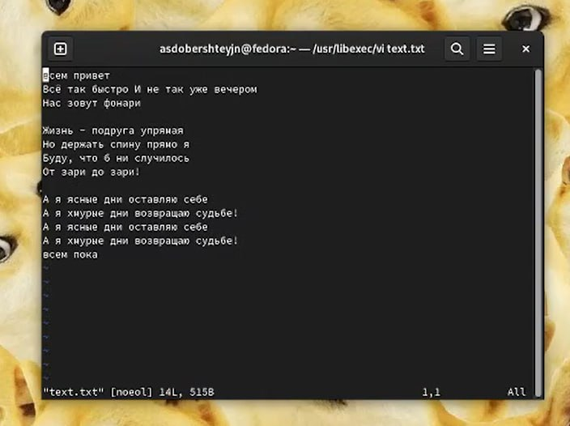{#fig:001 width=70%}

3. Создала каталог с именем ~/work/os/lab06.(рис. @fig:002).

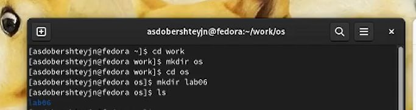{#fig:002 width=70%}

4. Перешла во вновь созданный каталог.(рис. @fig:003).

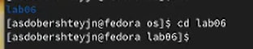{#fig:003 width=70%}

5. Вызвала vi и создала файл hello.sh(рис. @fig:004).

{#fig:004 width=70%}

6. Нажала клавишу i и ввела следующий текст(рис. @fig:005).

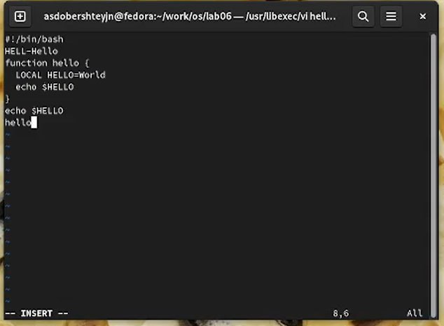{#fig:005 width=70%}

7. Нажала клавишу Esc для перехода в командный режим после завершения ввода
текста.(рис. @fig:006).

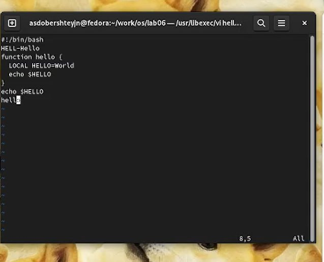{#fig:006 width=70%}

8. Нажала : для перехода в режим последней строки и внизу экрана появилось
приглашение в виде двоеточия.(рис. @fig:007).

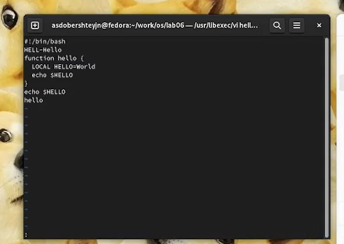{#fig:007 width=70%}

9. Нажала w (записать) и q (выйти), а затем нажмите клавишу Enter для сохранения
вашего текста и завершения работы.(рис. @fig:008).

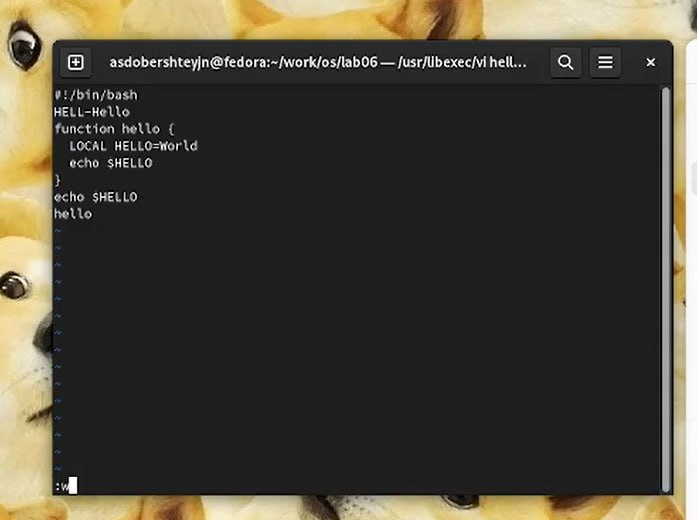{#fig:008 width=70%}

10. Сделала файл исполняемым(рис. @fig:009).

{#fig:009 width=70%}

11. Вызвала vi на редактирование файла
12. Установила курсор в конец слова HELL второй строки.
13. Перешла в режим вставки и заменила на HELLO. Нажала Esc для возврата в командный режим.(рис. @fig:010).

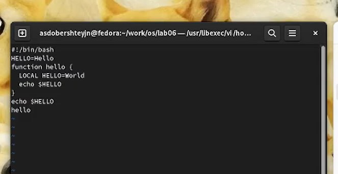{#fig:010 width=70%}

14. Установила курсор на четвертую строку и стерла слово LOCAL.(рис. @fig:011).

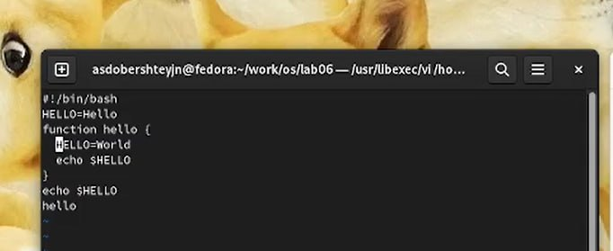{#fig:011 width=70%}

15. Перешла в режим вставки и набрала следующий текст: local, нажала Esc для
возврата в командный режим.(рис. @fig:012).

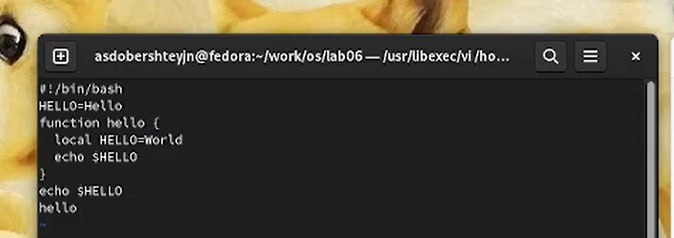{#fig:012 width=70%}

16. Установила курсор на последней строке файла. Вставила после неё строку, содержащую
следующий текст: echo $HELLO.(рис. @fig:013).

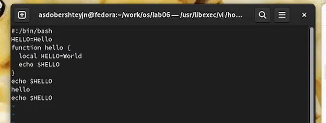{#fig:013 width=70%}

17. Нажала Esc для перехода в командный режим.
18. Удалила последнюю строку. (рис. @fig:014).

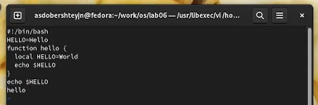{#fig:014 width=70%}

19. Ввела команду отмены изменений u для отмены последней команды.(рис. @fig:015).

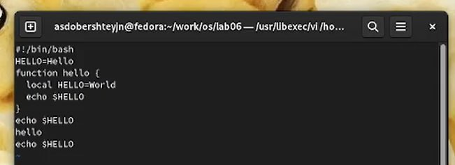{#fig:015 width=70%}

20. Ввела символ : для перехода в режим последней строки. Записала произведённые
изменения и вышла из vi.(рис. @fig:016).

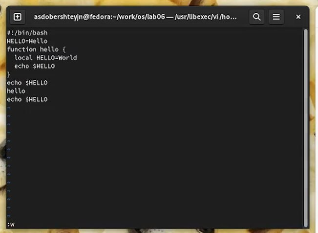{#fig:016 width=70%}

# Выводы

В ходе выполнения данной лабораторной работы я познакомилась с операционной системой Linux. Получила практические навыки работы с редактором vi, установленным по умолчанию практически во всех дистрибутивах.

# Контрольные вопросы

1. Дайте краткую характеристику режимам работы редактора vi.

    командный режим — предназначен для ввода команд редактирования и навигации по редактируемому файлу;
    режим вставки — предназначен для ввода содержания редактируемого файла;
    режим последней (или командной) строки — используется для записи изменений в файл и выхода из редактора.

2. Как выйти из редактора, не сохраняя произведённые изменения?

Можно нажимать символ q (или q!), если требуется выйти из редактора без сохранения.

3. Назовите и дайте краткую характеристику командам позиционирования.

    0 (ноль) — переход в начало строки;
    $ — переход в конец строки;
    G — переход в конец файла;
    n G — переход на строку с номером n.

4. Что для редактора vi является словом?

Редактор vi предполагает, что слово - это строка символов, которая может включать в себя буквы, цифры и символы подчеркивания.

5. Каким образом из любого места редактируемого файла перейти в начало (конец) файла?

С помощью G — переход в конец файла

6. Назовите и дайте краткую характеристику основным группам команд редактирования.

    Вставка текста – а — вставить текст после курсора; – А — вставить текст в конец строки; – i — вставить текст перед курсором; – n i — вставить текст n раз; – I — вставить текст в начало строки.
    Вставка строки – о — вставить строку под курсором; – О — вставить строку над курсором.
    Удаление текста – x — удалить один символ в буфер; – d w — удалить одно слово в буфер; – d $ — удалить в буфер текст от курсора до конца строки; – d 0 — удалить в буфер текст от начала строки до позиции курсора; – d d — удалить в буфер одну строку; – n d d — удалить в буфер n строк.
    Отмена и повтор произведённых изменений – u — отменить последнее изменение; – . — повторить последнее изменение.
    Копирование текста в буфер – Y — скопировать строку в буфер; – n Y — скопировать n строк в буфер; – y w — скопировать слово в буфер.
    Вставка текста из буфера – p — вставить текст из буфера после курсора; – P — вставить текст из буфера перед курсором.
    Замена текста – c w — заменить слово; – n c w — заменить n слов; – c $ — заменить текст от курсора до конца строки; – r — заменить слово; – R — заменить текст.
    Поиск текста – / текст — произвести поиск вперёд по тексту указанной строки символов текст; – ? текст — произвести поиск назад по тексту указанной строки символов текст.

7. Необходимо заполнить строку символами $. Каковы ваши действия?

Перейти в режим вставки.

8. Как отменить некорректное действие, связанное с процессом редактирования?

С помощью u — отменить последнее изменение

9. Назовите и дайте характеристику основным группам команд режима последней строки.

Режим последней строки — используется для записи изменений в файл и выхода из редактора.

10. Как определить, не перемещая курсора, позицию, в которой заканчивается строка?

$ — переход в конец строки

11. Выполните анализ опций редактора vi (сколько их, как узнать их назначение и т.д.).

Опции редактора vi позволяют настроить рабочую среду. Для задания опций используется команда set (в режиме последней строки): – : set all — вывести полный список опций; – : set nu — вывести номера строк; – : set list — вывести невидимые символы; – : set ic — не учитывать при поиске, является ли символ прописным или строчным.

12. Как определить режим работы редактора vi?

В редакторе vi есть два основных режима: командный режим и режим вставки. По умолчанию работа начинается в командном режиме. В режиме вставки клавиатура используется для набора текста. Для выхода в командный режим используется клавиша Esc или комбинация Ctrl + c .
