---
## Front matter
title: "Отчет по выполнению индивидуального проекта"
subtitle: "Четвертый этап"
author: "Доберштейн Алина Сергеевна"

## Generic otions
lang: ru-RU
toc-title: "Содержание"

## Bibliography
bibliography: bib/cite.bib
csl: pandoc/csl/gost-r-7-0-5-2008-numeric.csl

## Pdf output format
toc: true # Table of contents
toc-depth: 2
lof: true # List of figures
lot: true # List of tables
fontsize: 12pt
linestretch: 1.5
papersize: a4
documentclass: scrreprt
## I18n polyglossia
polyglossia-lang:
  name: russian
  options:
	- spelling=modern
	- babelshorthands=true
polyglossia-otherlangs:
  name: english
## I18n babel
babel-lang: russian
babel-otherlangs: english
## Fonts
mainfont: PT Serif
romanfont: PT Serif
sansfont: PT Sans
monofont: PT Mono
mainfontoptions: Ligatures=TeX
romanfontoptions: Ligatures=TeX
sansfontoptions: Ligatures=TeX,Scale=MatchLowercase
monofontoptions: Scale=MatchLowercase,Scale=0.9
## Biblatex
biblatex: true
biblio-style: "gost-numeric"
biblatexoptions:
  - parentracker=true
  - backend=biber
  - hyperref=auto
  - language=auto
  - autolang=other*
  - citestyle=gost-numeric
## Pandoc-crossref LaTeX customization
figureTitle: "Рис."
tableTitle: "Таблица"
listingTitle: "Листинг"
lofTitle: "Список иллюстраций"
lotTitle: "Список таблиц"
lolTitle: "Листинги"
## Misc options
indent: true
header-includes:
  - \usepackage{indentfirst}
  - \usepackage{float} # keep figures where there are in the text
  - \floatplacement{figure}{H} # keep figures where there are in the text
---

# Цель работы

Создать сайт на Hugo.

# Задание

1. Установить необходимое программное обеспечение.
2. Скачать шаблон темы сайта.
3. Разместить его на хостинге github.
4. Установить параметр для URLs сайта.
5. Разместить заготовку сайта на Github pages.

# Теоретическое введение

Сайт - это совокупность веб-страниц, объединенных под общим доменом и связанных ссылками, тематикой и дизайнерским оформлением. Мы будем создавать статический сайт, для этого нам понадобится Hugo - генератор статических страниц для интернета.

# Выполнение лабораторной работы

#Установка ПО
Скачала исполняемый файл Hugo последней версии с гитхаба. (рис. @fig:001).

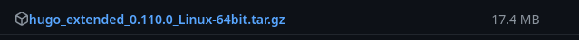{#fig:001 width=70%}

По умолчанию архив скачался в папку "Загрузки". Разархивировала, вырезала исполняемый файл из этой папки, создала в домашней папке пустой каталог "bin" (рис. @fig:002).

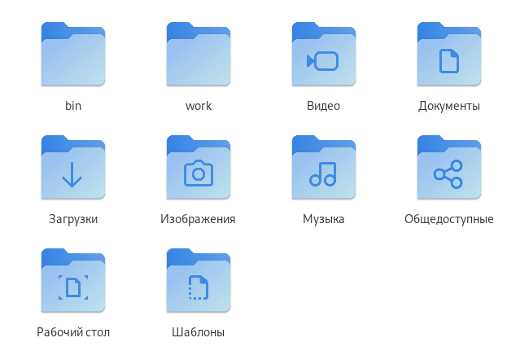{#fig:002 width=70%}

Вставила исполняемый файл в созданный пустой каталог (рис. @fig:003).

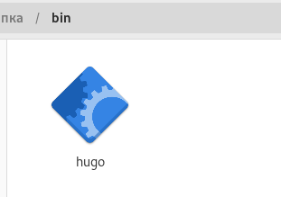{#fig:003 width=70%}

# Создание сайта

Взяла ссылку на шаблон репозитория с ТУИСа (рис. @fig:004).

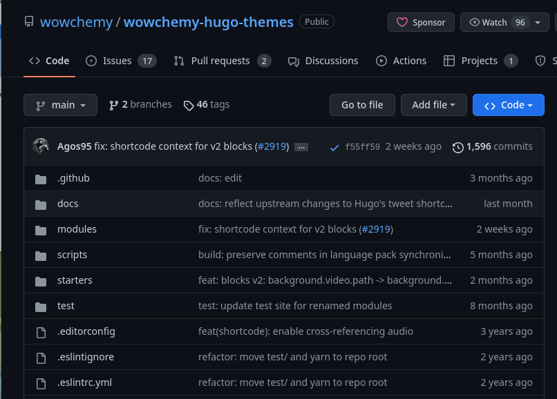{#fig:004 width=70%}

Используя этот шаблон, создала свой репозиторий "blog".(рис. @fig:005).

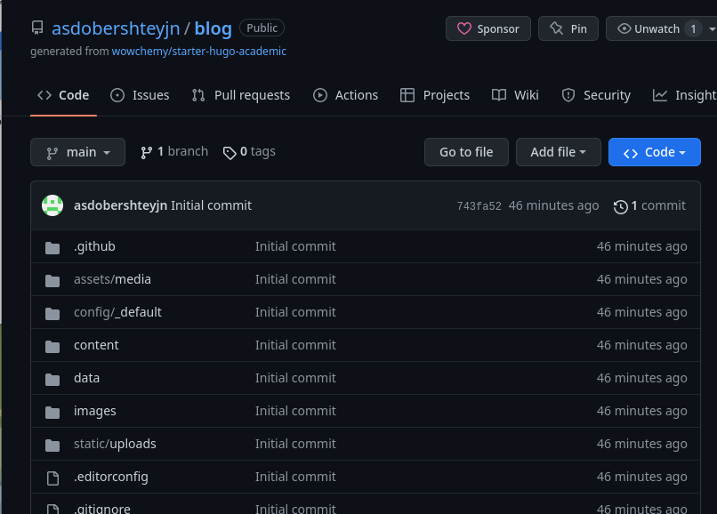{#fig:005 width=70%}

Клонировала репозиторий (рис. @fig:006).

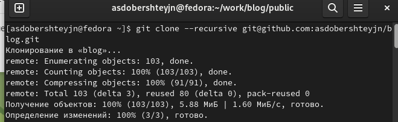{#fig:006 width=70%}

Перешла в каталог клонированный blog, проверила (рис. @fig:007).

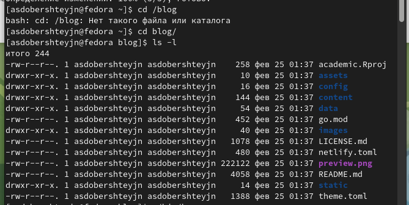{#fig:007 width=70%}

В клонированный каталог установила hugo (рис. @fig:008).

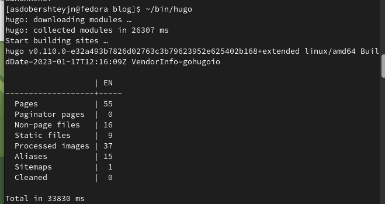{#fig:008 width=70%}

Проверяем с помощью команды ls. Заметили, что появился каталог public, который в дальнейшей работе будет нам мешать, поэтому удаляем его с помощью midnight commander. (рис. @fig:009).

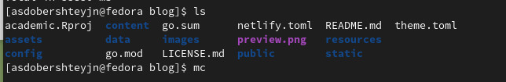{#fig:009 width=70%}

Выполнила Hugo server (рис. @fig:010).

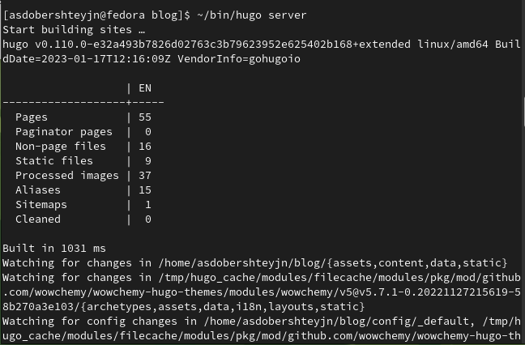{#fig:010 width=70%}

Скопировала полученную ссылку, вставила ее в браузер и получила сайт (рис. @fig:011).

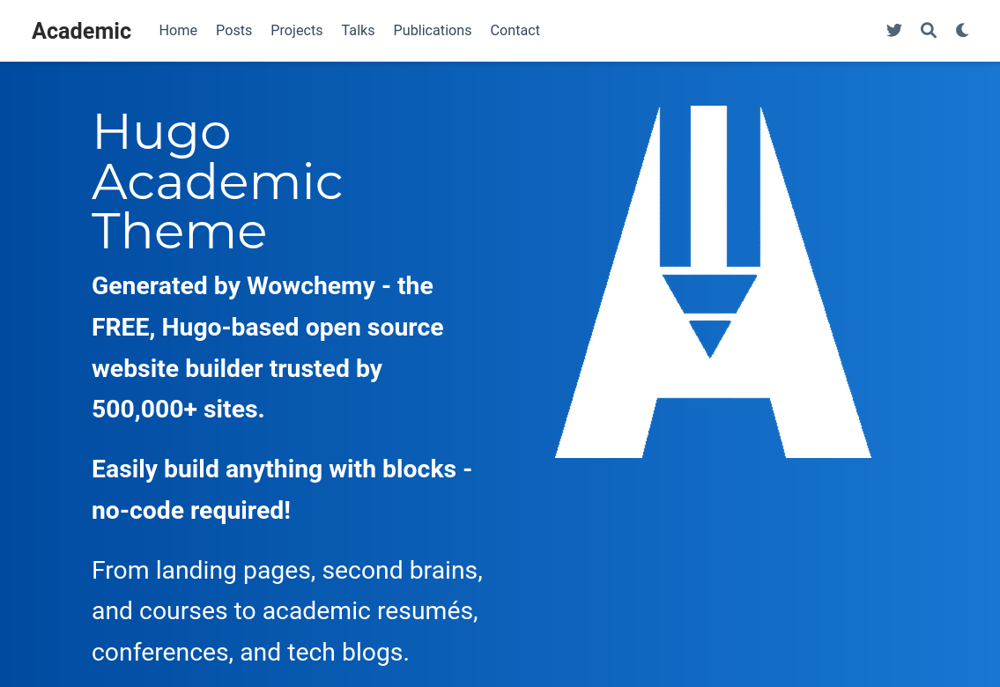{#fig:011 width=70%}

Создала еще один репозиторий со специальным названием "asdobershteyjn.github.io", чтобы перенести туда сайт, что позволит видеть сайт не только с локального компьютера, но и с любого другого. (рис. @fig:012).

{#fig:012 width=70%}

Перешла на уровень выше (рис. @fig:013).

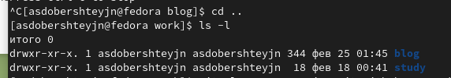{#fig:013 width=70%}

Рядом с каталогом блог клонировала новый репозиторий(рис. @fig:014).

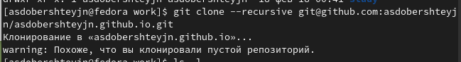{#fig:014 width=70%}

Проверила (рис. @fig:015).

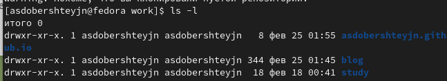{#fig:015 width=70%}

Перешла в созданный каталог, создала ветку "main", создала пустой файл "README.md", отправила его в репозиторий (рис. @fig:016).

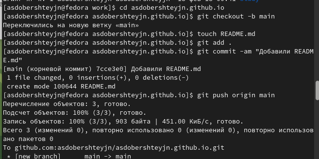{#fig:016 width=70%}

Перешла в каталог блог, подключила репозиторий к папке public внутри блога, (рис. @fig:017).

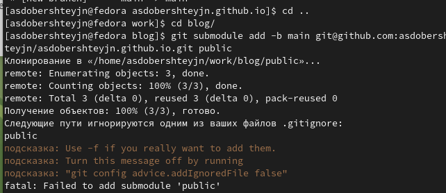{#fig:017 width=70%}

Так как в гитигноре стоит параметр игнорирования каталогов с названием public, исправила это с помощью midnight commander, закомментировав этот параметр. (рис. @fig:018).

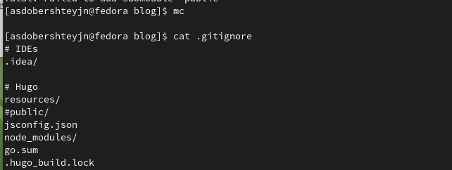{#fig:018 width=70%}

Повторила команду (рис. @fig:019).

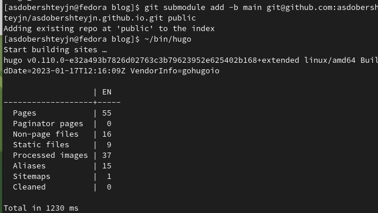{#fig:019 width=70%}

Установила Hugo в блог (рис. @fig:020).

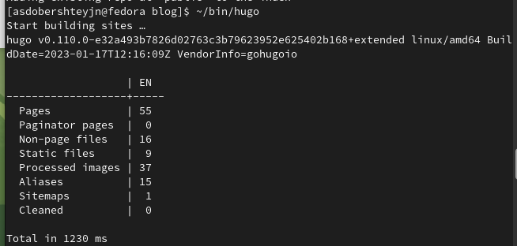{#fig:020 width=70%}

В папке паблик появились каталоги и файлы сайта (рис. @fig:021).

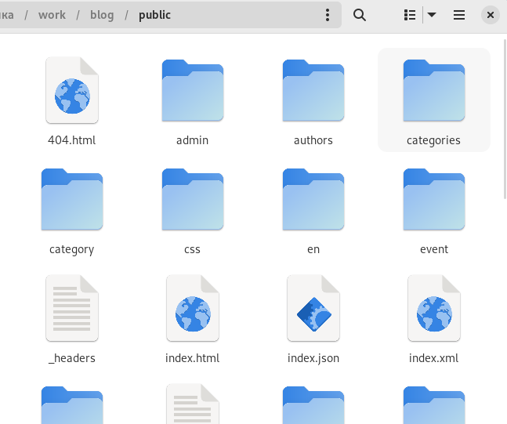{#fig:021 width=70%}

Отправила созданные файлы сайта в репозиторий (рис. @fig:022), (рис. @fig:023).

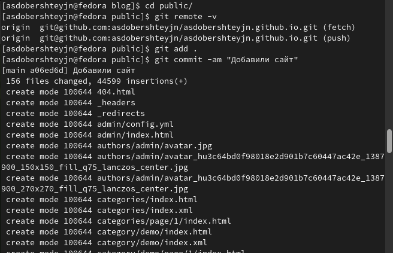{#fig:022 width=70%}

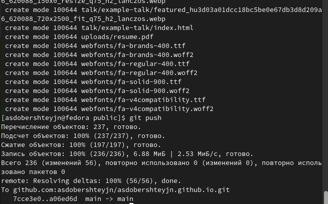{#fig:023 width=70%}

Проверила репозиторий (рис. @fig:024).

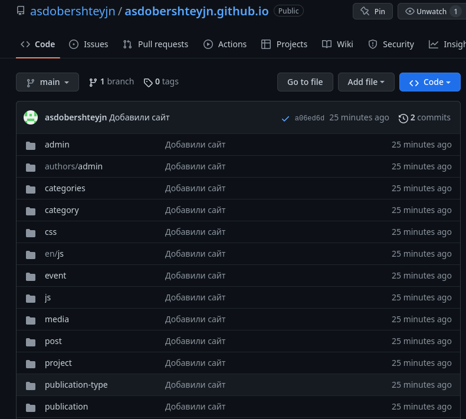{#fig:024 width=70%}

Скопировала ссылку на новый сайт, вставила в браузер. (рис. @fig:025).

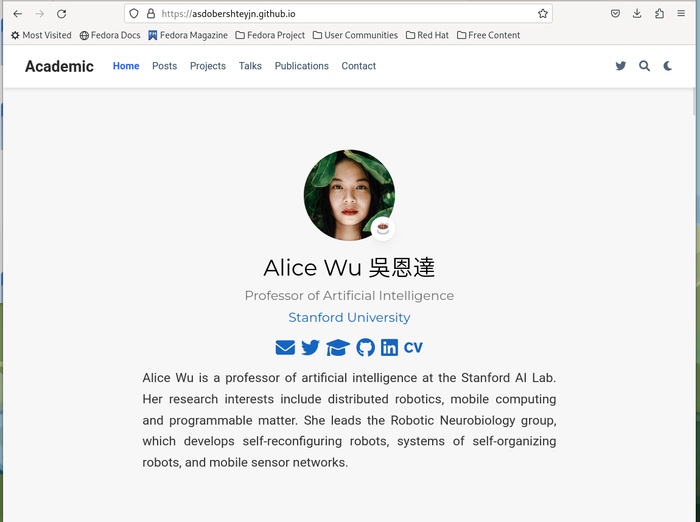{#fig:025 width=70%}

# Выводы

В ходе выполнения данного этапа индивидуального проекта я научилась создавать статические сайты с помощью Hugo.

# Список литературы{.unnumbered}

Что такое сайт (простыми словами) [Электронный ресурс]. URL: https://uguide.ru/chto-takoe-sajt-prostymi-slovami.

::: {#refs}
:::
